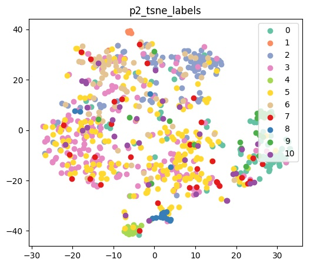

# Video-action-recognition
Video data processing, trimmed action recognition and temporal action segmentation

## Tasks
1. Extract deep CNN features with state-of-the-art models.
2. Implement recurrent neural networks (RNN) for action recognition of trimmed action recognition.
3. Extend RNN model to solve sequence-to-sequence temporal action segmentation problem.

## Dataset description
In the starter code of this repository, we have provided a shell script for downloading and extracting the dataset. For Linux users, simply use the following command.

    bash ./get_dataset.sh
The shell script will automatically download the dataset and store the data in a folder called `hw4_data`. Note that this command by default only works on Linux. 

For this dataset, the action labels are defined as below:

|       Action      | Label |
|:-----------------:|:-----:|
| Other             | 0     |
| Inspect/Read      | 1     |
| Open              | 2     |
| Take              | 3     |
| Cut               | 4     |
| Put               | 5     |
| Close             | 6     |
| Move Around       | 7     |
| Divide/Pull Apart | 8     |
| Pour              | 9     |
| Transfer          | 10    |

**Trimmed videos (For Task 1 & For Task 2)**
* train,valid – 240x320 trimmed videos are named as: <Video_category>/<Video_name><some_index>.mp4

* gt_train.csv/gt_valid.csv
<Video_index>, <Video_name>, <Video_category>, 
<Start_times>, <End_times>, <Action_labels>, <Nouns>
  
**Full-length videos (For Task 3)**
* train,valid – 240x320 video frames in folder are named as: <Video_category>/<Frame_index>.jpg

* groundtruth - <Video_category>.txt 
sequence of action labels correspond to their frame index.

## Extract features for recognition 
### Strategy
Here I apply mean strategy to extract the feature from a single video. I select about 10 images with the same time interval from a video. Next, I use resnet50 as the feature extractor to get features of every image. Then, I calculate mean of the 10 images to represent this video. By applying this strategy to every video to I can get a set of video features. 

I train the extracted video features with a single layer fully connected network to get the recognition result.

### Model

with batch size = 4, SGD(Learning rate = 1e-3, momentum=0.9)

### Results

 

The recognition performance on validation dataset achives 51.11%.

### Visualization

## Trimmed action recognition
### Strategy
Here I use the same 10 images of each video, but this time I use a single layer lstm(hidden_layer=32). After getting the result of the last output, I use a single layer fully connected network to classify video actions.  

### Model

with batch size = 10, SGD(Learning rate = 1e-3, momentum=0.9), fix CNN parameters, only training lstm and fc

### Results

 

Validation dataset accuracy improve from 51.11% to 53.06%. The accuracy improves a little since the relation of consecutive frames is learned by the lstm layer.

### Visualization

## Temporal action segmentation
### Strategy
I random select 700 images and sort them into correct order. I use a single layer bi-directional lstm and a single layer fully connected network to predict action of each time frame.

### Model

with, batch size = 1, Adam(Learning rate=1e-4) ,fix CNN parameters, only training lstm and fc, weight balanced (1-ratio)

### Results

 

|            Videos            | Accuracy |
|:----------------------------:|:--------:|
| OP01-R02-TurkeySandwich      | 53.26%   |
| OP01-R04-ContinentalBreakfast| 59.67%   |
| OP01-R07-Pizza               | 55.00%   |
| OP03-R04-ContinentalBreakfast| 51.74%   |
| OP04-R04-ContinentalBreakfast| 62.95%   |
| OP05-R04-ContinentalBreakfast| 53.48%   |
| OP06-R03-BaconAndEggs        | 60.35%   |

### Visualization

In this video, label 0(other), 4(cut), 7(move around) are easier to predict. The reason might be that they have larger portion than other labels in the dataset. They time length of their continuous frames are longer as well. In this unbalanced situation, the model will tend to leanrn and predict the actions. Even though I weighted different actions before training according to their portion in dataset inversely, the results still stay the same.

## Running the test
Following commands will automatically download the model trained by myself to predict the recognition results.

### Extract features for recognition

    bash ./p1.sh $1 $2 $3
-   `$1` is the folder containing the ***trimmed*** validation videos (e.g. `TrimmedVideos/video/valid/`).
-   `$2` is the path to the ground truth label file for the videos (e.g. `TrimmedVideos/label/gt_valid.csv`).
-   `$3` is the folder to output predicted labels (e.g. `./output/`).

### Trimmed action recognition

    bash ./p2.sh $1 $2 $3
-   `$1` is the folder containing the ***trimmed*** validation/test videos.
-   `$2` is the path to the ground truth label file for the videos (e.g. `TrimmedVideos/label/gt_valid.csv` or `TrimmedVideos/label/gt_test.csv`).
-   `$3` is the folder to output predicted labels (e.g. `./output/`).

### Temporal action segmentation

    bash ./p3.sh $1 $2
-   `$1` is the folder containing the ***full-length*** validation videos.
-   `$2` is the folder to output predicted labels (e.g. `./output/`).
